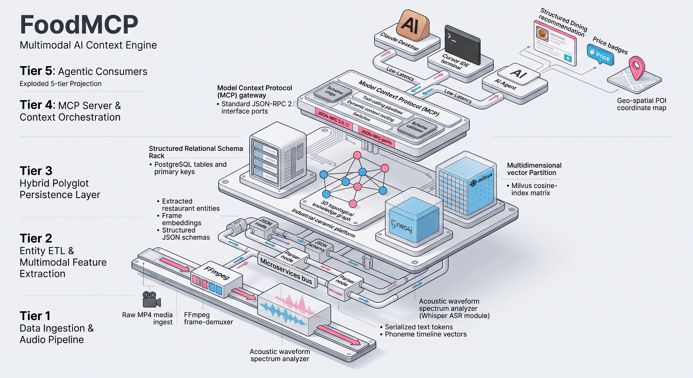
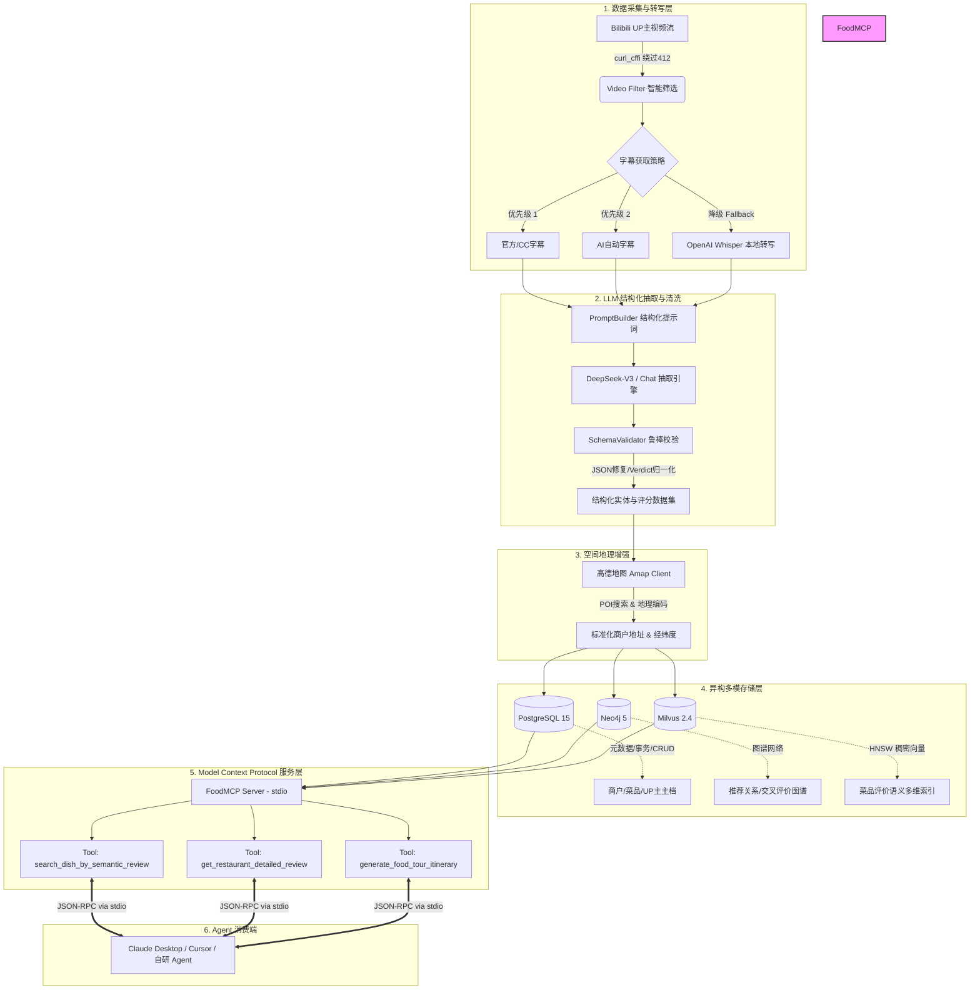

<div align="center">

# 🍽️ FoodMCP: B站探店视频深度解析与餐饮知识 Agent 服务

> **首个基于 LLM + MCP 协议的“视频级”餐饮点评语义聚合与智能体检索引擎**  
> 从非结构化探店长视频到“菜品级”结构化知识图谱，通过 Model Context Protocol (MCP) 原生赋能现代 AI Agent

[](https://www.python.org/)
[](https://modelcontextprotocol.io/)
[](https://www.deepseek.com/)
[](https://www.docker.com/)
[](https://www.postgresql.org/)
[](https://neo4j.com/)
[](https://milvus.io/)
[](LICENSE)

[中文文档](#-一产品概述) · [系统架构](#-三系统架构设计) · [技术难点攻坚](#-四核心技术难点与工程攻坚) · [极速上手](#-六快速开始) · [Claude/Cursor配置](#-七-claude-desktop--cursor-接入指南) · [产品白皮书 (PORTFOLIO)](PORTFOLIO.md)

</div>

---

## 📌 一、产品概述

### 1.1 为什么做这个项目？(痛点与背景)

传统餐饮点评平台（大众点评、美团）与 B 站美食内容生态存在天然的痛点鸿沟：
- **大众点评/美团**：评分机制通胀、刷单泛滥，用户评价停留在“店铺整体”粒度，用户无法通过口语化需求检索特定菜品（如：“想吃北京肉质扎实、锅气足但不咸的干炸丸子”）。
- **B 站美食探店**：真实度高、细节丰富，但**长视频信息密度极低**。用户必须逐个看完 10~20 分钟的视频或在大海捞针般的弹幕/评论区中爬楼，信息无法被结构化索引与交叉验证。

**FoodMCP 的解决方案**：
构建自动化流水线，将 B站探店视频中的非结构化视听信息，通过 **大模型信息抽取与清洗** 转化为 **`城市 → 餐厅 → 菜品 → 五维度评价 → 情绪`** 的多维结构化知识网络，借助 **异构三库（关系+图+向量）** 深度沉淀，并基于 **MCP (Model Context Protocol)** 标准协议对外提供原子化 Agent 工具。

### 1.2 差异化竞争矩阵

| 维度 | 大众点评 / 美团 | B 站原生搜索 / 小程序 | 🌟 FoodMCP |
| :--- | :--- | :--- | :--- |
| **评价真实度** | ⭐⭐ 刷分/商业化严重 | ⭐⭐⭐⭐ UP 主实地试吃 | ⭐⭐⭐⭐⭐ 多 UP 主交叉背书 |
| **信息粒度** | 餐厅级（整体打分） | 视频级（需全片观看） | **菜品级**（单菜色香味深度细分） |
| **检索方式** | 关键词标签硬匹配 | 视频标题硬匹配 | **自然语言语义模糊检索** |
| **知识关系** | 孤立商户列表 | 独立视频流 | **UP 主 - 探店 - 餐厅 - 菜品知识图谱** |
| **AI 生态集成** | 封闭生态 | 封闭生态 | **原生标准 MCP 协议，即插即用** |

---

## 🎯 二、产品价值与应用场景

```
                          ┌─────────────────────────────┐
                          │   用户/Agent 发起自然语言请求 │
                          └──────────────┬──────────────┘
                                         ▼
┌──────────────────────────────────────────────────────────────────────────────────┐
│                             🌟 FoodMCP 赋能三大场景                               │
├──────────────────────────┬───────────────────────────┬───────────────────────────┤
│ 🔍 场景 1: 菜品级语义精准检索 │ 📊 场景 2: 多UP主交叉背书评价 │ 🗺️ 场景 3: 智能美食动线规划 │
│ "想找肥而不腻、卤香味醇厚的卤肉饭"│ "隋卞和大祥哥都去过的那家店到底如何?"│ "生成3天上海老字号打卡路线" │
│ ➡️ 基于向量语义直接命中菜品原话 │ ➡️ 图谱联合查询，输出褒贬交叉验证   │ ➡️ 结合高德坐标与营业信息路线排布 │
└──────────────────────────┴───────────────────────────┴───────────────────────────┘
```

---

## 🏗️ 三、系统架构设计

<div align="center">
  
</div>

系统整体采用 **分层解耦 + 异构混合存储 + 标准化协议暴露** 的架构体系：



---

## ⚙️ 四、核心技术难点与工程攻坚

### 1. ⚔️ B 站 412 WAF 防控与 TLS 指纹对抗
* **挑战**：B 站反爬 WAF 对非浏览器行为实施强拦截，常规 `requests` / `httpx` 请求即使携带有效 Cookie 仍会被拦截并返回 `412 Precondition Failed`。
* **攻坚方案**：在底层集成 `curl-cffi`，在 Python 侧精准模拟现代浏览器（Chrome 120+）的 TLS/JA3 指纹与 HTTP/2 连接特征；结合动态指数退避与全局请求频率控制（≥ 2.0s 间隔），实现长期稳定自动化采集。

### 2. 🧠 LLM 结构化抽取鲁棒性保障与成本优化
* **挑战**：探店视频口语化极强、语气含蓄（如：“火候稍欠”实为踩雷）、文本过长可能出现幻觉或输出格式破碎。
* **攻坚方案**：
  * **容错校验器（SchemaValidator）**：支持原生 JSON、Markdown 代码块及混合脏文本自动提取与修复，字段缺失时执行平滑默认降级；
  * **情绪与评价标准化**：构建语义映射字典，将“绝了”、“避雷”、“一言难尽”等数十种口语归一化为标准的 3 级情绪（推荐 / 一般 / 踩雷）；
  * **双 API 成本效益架构**：抽取任务采用高性价比的 **DeepSeek (`deepseek-chat`)**，向量化采用 **OpenAI (`text-embedding-3-small`)**，单视频解析成本降至约 ¥0.03。

### 3. 🗄️ 异构三库混合存储协同机制
针对餐饮数据的高维、复杂关系与模糊检索特性，摒弃单一数据库方案，因地制宜设计异构三库：
* **PostgreSQL (ACID 核心库)**：存储餐厅、菜品、UP 主与探店评价的规范化元数据，提供高可靠 CRUD 与统计聚合；
* **Neo4j (图数据库)**：构建 `(UP主)-[:REVIEWED]->(餐厅)` 和 `(餐厅)-[:SERVES]->(菜品)` 的多维拓扑，秒级响应“多 UP 主共同推荐”的图谱查询；
* **Milvus (向量检索库)**：基于 HNSW 索引与 COSINE 相似度，存储菜品口味、特色、评价切片的 1536 维语义向量，实现纯自然语言模糊搜索。

### 4. 🗺️ 高德 POI 空间地理增强
* **方案**：集成高德 Web 服务 API，在流水线中自动提取“餐厅名 + 城市”并执行 POI 检索与地理编码，补全行政区划与真实高精度经纬度，为行程规划工具提供精准物理空间距离计算基础。

### 5. 🔌 原生 Model Context Protocol (MCP) 协议落地
* 严格基于 Anthropic 官方 `mcp-python` SDK 规范，通过 `stdio` 协议暴露 3 个核心原子能力，无缝接入主流智能体（Claude Desktop, Cursor, Goose, LangChain）。

---

## 📊 五、MVP 验证成果

以知名美食 UP 主 **“特厨隋卞”**（国家级特级厨师、B 站数百万粉丝）视频集进行端到端验证：

| 验证指标 | 实测数据 |
| :--- | :--- |
| **视频采集样本** | 60 个视频 |
| **探店视频命中** | 37 / 60 个（规则评分系统准确过滤闲聊与教程视频） |
| **入库餐厅** | 2 家（8.4 优雅河鲜、山居满陇） |
| **提取精细化菜品** | 11 道（包含口感、色泽、锅气、刀工等多维度细节与原话） |
| **三库存储写入率** | 100%（PG 实体、Neo4j 节点边、Milvus 向量全部一致写入） |
| **核心单元测试** | 11 / 11 全部通过 |

---

## 🚀 六、快速开始

### 6.1 前置要求
- Python 3.11+
- Docker & Docker Compose
- 高德开放平台 Web 服务 Key
- DeepSeek 或 OpenAI API Key

### 6.2 步骤 1: 克隆项目并安装依赖

```bash
git clone https://github.com/JohnMaxwell0123/FoodMCP.git
cd FoodMCP

# 创建并激活虚拟环境
python -m venv .venv
.venv\Scripts\activate     # Windows
# source .venv/bin/activate # Linux / macOS

# 安装核心依赖与开发套件
pip install -e ".[dev]"
```

### 6.3 步骤 2: 一键启动三库环境 (Docker Compose)

```bash
docker compose up -d
```
启动成功后将包含：
- **PostgreSQL 15**：端口 `5433`
- **Neo4j 5**：端口 `7474` (Web 管理台) / `7687` (Bolt)
- **Milvus 2.4**：端口 `19530`

### 6.4 步骤 3: 环境变量配置

```bash
cp .env.example .env
```
编辑 `.env` 填入您的配置：
```ini
# B站凭据 (从浏览器 Cookie 复制)
BILIBILI_SESSDATA=your_sessdata
BILIBILI_BILI_JCT=your_bili_jct
BILIBILI_BUVID3=your_buvid3

# LLM 与 Embedding
OPENAI_API_KEY=your_deepseek_api_key
OPENAI_BASE_URL=https://api.deepseek.com
LLM_MODEL=deepseek-chat

EMBEDDING_API_KEY=your_openai_api_key
EMBEDDING_BASE_URL=https://api.openai.com/v1
EMBEDDING_MODEL=text-embedding-3-small

# 高德地图
AMAP_API_KEY=your_amap_key
```

### 6.5 步骤 4: 运行自动化采集与处理流水线

```bash
# 采集指定 UP 主（如特厨隋卞 MID: 1462401621）的探店视频并写入三库
python -m scripts.run_pipeline --up-mid 1462401621 --city 北京 --limit 5
```

---

## 🤖 七、Claude Desktop / Cursor 接入指南

作为原生 MCP Server，可以直接配置在 Claude Desktop 或 Cursor 中：

### Claude Desktop 配置 (`claude_desktop_config.json`)
```json
{
  "mcpServers": {
    "food-mcp": {
      "command": "d:\\Document\\Project\\foodrecomandation\\.venv\\Scripts\\python.exe",
      "args": [
        "-m",
        "src.mcp_server.server"
      ],
      "cwd": "d:\\Document\\Project\\foodrecomandation"
    }
  }
}
```

### 可用 MCP Tools 列表：
1. `search_dish_by_semantic_review`：输入口语化口味需求，返回 Milvus 向量相似度最高的菜品与 UP 主评价。
2. `get_restaurant_detailed_review`：联合 PG 与 Neo4j 查询特定餐厅的多 UP 主综合评测与菜品红黑榜。
3. `generate_food_tour_itinerary`：指定城市与天数，结合地理坐标自动生成连贯的美食打卡路线规划。

---

## 📂 八、项目代码结构

```
foodrecomandation/
├── config/                  # Pydantic Settings 全局统一配置
│   └── settings.py
├── src/
│   ├── models/              # Pydantic 数据模型 (Restaurant, Dish, Review...)
│   ├── collector/           # B站采集引擎 (curl_cffi 防风控 + 视频筛选 + 字幕下载)
│   ├── transcriber/         # Whisper 语音转录 (本地 ASR 降级方案)
│   ├── extractor/           # LLM 结构化信息抽取 (Prompt + 容错校验器)
│   ├── geocode/             # 高德地图 POI 检索与地理编码
│   ├── storage/             # 异构存储层 (PostgreSQL + Neo4j + Milvus)
│   ├── pipeline/            # 端到端自动化 Pipeline 编排
│   └── mcp_server/          # 原生 Model Context Protocol 服务端
├── scripts/
│   ├── run_pipeline.py      # CLI 执行入口
│   └── demo_bilibili.py     # 连通性测试脚本
├── tests/                   # 核心模块自动化单元测试
├── docker-compose.yml       # 一键三库编排文件
├── pyproject.toml           # 现代 Python 依赖管理
├── PORTFOLIO.md             # 📖 产品设计白皮书：产品思维 + 商业分析 + 场景闭环
├── SUMMARY.md               # 📄 项目 Executive Summary
├── presentation.html        # 💻 交互式产品演示页面
└── PROGRESS.md              # 🛠️ 研发全流程演进记录
```

---

## 👥 维护与设计文档

本项目由 **[John Maxwell (@JohnMaxwell0123)](https://github.com/JohnMaxwell0123)** 独立构思、设计与落地：
- 📚 **产品设计与商业模式**：详见 **[产品设计白皮书 (PORTFOLIO.md)](PORTFOLIO.md)**
- 📄 **架构与设计概要**：详见 **[一页纸项目概要 (SUMMARY.md)](SUMMARY.md)**
- 💻 **交互式展示**：详见 **[Web 端产品演示 (presentation.html)](presentation.html)**

欢迎在 GitHub 提交 Issue 或 PR 参与交流！

---

## 📄 License

本项目采用 [MIT License](LICENSE) 开源协议。

